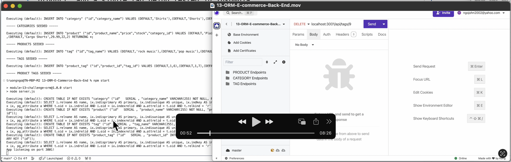

# E-Commerce Backend System

## Table of Contents
- [Description](#description)
- [User Story](#user-story)
- [Acceptance Criteria](#acceptance-criteria)
- [Installation](#installation)
- [Usage](#usage)
- [API Endpoints](#api-endpoints)
- [Test](#test)
- [Technologies Used](#technologies-used)
- [Contributing](#contributing)
- [Walkthrough Video](#walkthrough-video)
- [Credits](#credits)
- [License](#license)

## Description
The E-Commerce Backend System is designed to provide robust API services for managing an e-commerce platform’s inventory. This backend system allows users to perform CRUD operations on products, categories, and tags through a clean and easy-to-use API interface. Developed using Express.js and Sequelize, it connects seamlessly with a PostgreSQL database, ensuring efficient data handling and security.

[Back to Top](#table-of-contents)

## User Story

```md
AS A manager at an internet retail company
I WANT a back end for my e-commerce website that uses the latest technologies
SO THAT my company can compete with other e-commerce companies
```

[Back to Top](#table-of-contents)

## Acceptance Criteria

```md
GIVEN a functional Express.js API
WHEN I add my database name, PostgreSQL username, and PostgreSQL password to an environment variable file
THEN I am able to connect to a database using Sequelize
WHEN I enter schema and seed commands
THEN a development database is created and is seeded with test data
WHEN I enter the command to invoke the application
THEN my server is started and the Sequelize models are synced to the PostgreSQL database
WHEN I open API GET routes in Insomnia for categories, products, or tags
THEN the data for each of these routes is displayed in a formatted JSON
WHEN I test API POST, PUT, and DELETE routes in Insomnia
THEN I am able to successfully create, update, and delete data in my database
```

[Back to Top](#table-of-contents)

## Installation

To get this project up and running on your local machine, follow these steps:

### Prerequisites
- Node.js
- npm (Node Package Manager)
- PostgreSQL

### Steps
1. Clone the repository:
   ```bash
   git clone git@github.com:ngojohn2002/13-ORM-E-Commerce-Back-End.git
   ```
2. Navigate to the project directory:
   ```bash
   cd 13-ORM-E-Commerce-Back-End
   ```
3. Install dependencies:
   ```bash
   npm install
   ```
4. Create a `.env` file in the root directory and update the following settings with your database credentials:
   ```plaintext
   DB_NAME=ecommerce_db
   DB_USER=yourUsername
   DB_PASSWORD=yourPassword
   ```
5. Run the schema.sql in PostgreSQL to create your database:
   ```sql
   DROP DATABASE IF EXISTS ecommerce_db;
   CREATE DATABASE ecommerce_db;
   ```

   Alternatively, you can run:
   ```sql
   psql -U postgres -f db/schema.sql
   ```

6. Seed the database:
   ```bash
   npm run seed
   ```

[Back to Top](#table-of-contents)

## Usage
Start the server:
   ```bash
   npm start
   ```

The server will start on `http://localhost:3001`. You can use API testing tools like Postman or Insomnia to interact with the API.

[Back to Top](#table-of-contents)

## API Endpoints
- `GET /api/categories` - Retrieve all categories
- `POST /api/categories` - Create a new category
- `GET /api/categories/:id` - Retrieve a category by id
- `PUT /api/categories/:id` - Update a category by id
- `DELETE /api/categories/:id` - Delete a category by id

*Similar endpoints exist for products and tags.*

[Back to Top](#table-of-contents)

## Test

When testing the e-commerce backend, ensure that you thoroughly test all CRUD (Create, Read, Update, Delete) operations for the main entities in the application. These typically include:

1. **Products**
2. **Categories**
3. **Tags**
4. **Product Tags (associations between products and tags)**

Each of these entities has its own set of endpoints and operations that need to be tested to ensure your application works as expected. Here’s a detailed overview of what to test for each entity:

### 1. Products
- **Create (POST)**: Create a new product.
  - URL: `http://localhost:3001/api/products`
  - Body example:
    ```json
    {
      "product_name": "New Product",
      "price": 29.99,
      "stock": 100,
      "category_id": 1,
      "tagIds": [1, 2]
    }
    ```

- **Read (GET)**: Retrieve products.
  - All products: `http://localhost:3001/api/products`
  - Single product by ID: `http://localhost:3001/api/products/:id`

- **Update (PUT)**: Update an existing product by ID.
  - URL: `http://localhost:3001/api/products/:id`
  - Body example:
    ```json
    {
      "product_name": "Updated Product",
      "price": 39.99,
      "stock": 150,
      "category_id": 2,
      "tagIds": [2, 3]
    }
    ```

- **Delete (DELETE)**: Delete a product by ID.
  - URL: `http://localhost:3001/api/products/:id`

### 2. Categories
- **Create (POST)**: Create a new category.
  - URL: `http://localhost:3001/api/categories`
  - Body example:
    ```json
    {
      "category_name": "New Category"
    }
    ```

- **Read (GET)**: Retrieve categories.
  - All categories: `http://localhost:3001/api/categories`
  - Single category by ID: `http://localhost:3001/api/categories/:id`

- **Update (PUT)**: Update an existing category by ID.
  - URL: `http://localhost:3001/api/categories/:id`
  - Body example:
    ```json
    {
      "category_name": "Updated Category"
    }
    ```

- **Delete (DELETE)**: Delete a category by ID.
  - URL: `http://localhost:3001/api/categories/:id`

### 3. Tags
- **Create (POST)**: Create a new tag.
  - URL: `http://localhost:3001/api/tags`
  - Body example:
    ```json
    {
      "tag_name": "New Tag"
    }
    ```

- **Read (GET)**: Retrieve tags.
  - All tags: `http://localhost:3001/api/tags`
  - Single tag by ID: `http://localhost:3001/api/tags/:id`

- **Update (PUT)**: Update an existing tag by ID.
  - URL: `http://localhost:3001/api/tags/:id`
  - Body example:
    ```json
    {
      "tag_name": "Updated Tag"
    }
    ```

- **Delete (DELETE)**: Delete a tag by ID.
  - URL: `http://localhost:3001/api/tags/:id`

### 4. Product Tags (Associations)
- **Create Associations**: Typically, associations are handled when creating or updating products. Ensure that the `tagIds` array in the product request body correctly creates associations in the `ProductTag` join table.
  - URL for Product creation or update (with `tagIds` array): `http://localhost:3001/api/products`
  - Body example for creation:
    ```json
    {
      "product_name": "New Product",
      "price": 29.99,
      "stock": 100,
      "category_id": 1,
      "tagIds": [1, 2]
    }
    ```
  - Body example for update:
    ```json
    {
      "product_name": "Updated Product",
      "price": 39.99,
      "stock": 150,
      "category_id": 2,
      "tagIds": [2, 3]
    }
    ```

- **Read Associations**: Ensure that fetching a product includes its associated tags.
  - URL for fetching products: `http://localhost:3001/api/products`
  - Check that the response includes associated tags.

### Testing CRUD Operations

Here's a structured approach to testing CRUD operations:

1. **Setup**:
   - Make sure your server is running.
   - Open Insomnia and create a workspace for your API testing.

2. **Create Requests**:
   - For each entity (Products, Categories, Tags, Product Tags), create a new request in Insomnia for each CRUD operation.

3. **Send Requests and Review Responses**:
   - For each request, click "Send" and review the response to ensure it matches the expected output (correct status code, expected data format, etc.).

4. **Organize Requests**:
   - Group your requests in folders for each entity to keep your workspace organized.

### Example Folder Structure in Insomnia

- **Product Endpoints**
  - Create Product (POST)
  - Get All Products (GET)
  - Get Product by ID (GET)
  - Update Product (PUT)
  - Delete Product (DELETE)

- **Category Endpoints**
  - Create Category (POST)
  - Get All Categories (GET)
  - Get Category by ID (GET)
  - Update Category (PUT)
  - Delete Category (DELETE)

- **Tag Endpoints**
  - Create Tag (POST)
  - Get All Tags (GET)
  - Get Tag by ID (GET)
  - Update Tag (PUT)
  - Delete Tag (DELETE)

- **Product-Tag Associations**
  - Verify associations when creating/updating products

### Summary

By following this structured approach, you can thoroughly test the CRUD operations for all main entities in the e-commerce backend, ensuring the system works as expected.

[Back to Top](#table-of-contents)

## Technologies Used
- **Node.js** - JavaScript runtime built on Chrome's V8 JavaScript engine.
- **Express.js** - Web application framework for Node.js.
- **Sequelize** - A promise-based Node.js ORM for Postgres, MySQL, MariaDB, SQLite, and Microsoft SQL Server.
- **PostgreSQL** - An open source object-relational database system.
- **Dotenv** - A zero-dependency module that loads environment variables from a `.env` file into `process.env`.

[Back to Top](#table-of-contents)

## Contributing
Contributions to this project are welcome! Here are some ways you can contribute:
- Report bugs.
- Add new features.
- Improve documentation.

To contribute:
1. Fork the repository.
2. Create a new branch: `git checkout -b feature-branch-name`.
3. Make your changes and commit them: `git commit -am 'Add some feature'`
4. Push to the original branch: `git push origin feature-branch-name`
5. Create the pull request.

Alternatively, see the GitHub documentation on [creating a pull request](https://help.github.com/articles/creating-a-pull-request/).

[Back to Top](#table-of-contents)

## Walkthrough Video

The walkthrough video demonstrates the CRUD functionalities of the e-commerce back end (i.e., POST, GET, PUT, and DELETE operations) for products, categories, and tags being tested in Insomnia.

* The walkthrough video shows all of the technical acceptance criteria being met.
* The walkthrough video demonstrates how to create the schema from the PostgreSQL shell.
* The walkthrough video demonstrates how to seed the database from the command line.
* The walkthrough video demonstrates how to start the application’s server.
* The walkthrough video demonstrates GET routes for all categories, all products, and all tags being tested in Insomnia.
* The walkthrough video demonstrates GET routes for a single category, a single product, and a single tag being tested in Insomnia.
* The walkthrough video demonstrates POST, PUT, and DELETE routes for categories, products, and tags being tested in Insomnia.

Click on the screenshot below to visit the walkthrough video hosted on Youtube (Note: For best viewing experience, choose Settings > Quality > 2160p60 4K):

[](https://youtu.be/2ubp6VzjCMc)

[Back to Top](#table-of-contents)

## Credits

This project was made possible with the help of [ChatGPT](https://chatgpt.com/).

[Back to Top](#table-of-contents)

## License
This project is licensed under the MIT License - see the [LICENSE.md](./LICENSE.md) file for details.

[Back to Top](#table-of-contents)

---

© 2024 - All Rights Reserved.
